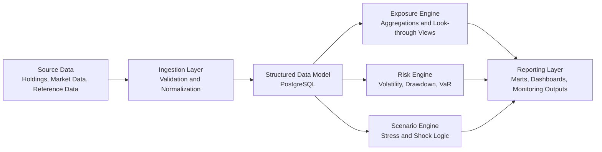
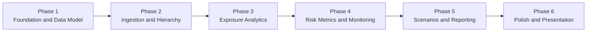

# RiskLens

Portfolio risk and exposure analytics platform for multi-entity, hedge-fund-style portfolios.

## Overview

RiskLens is an end-to-end portfolio risk analytics platform built to show how Risk IT can support investment and risk teams through data pipelines, portfolio hierarchy modeling, core risk calculations, monitoring logic, and dashboard-ready reporting outputs.

The platform is designed to ingest holdings, market data, and portfolio structure information, aggregate exposures across multiple reporting levels, and calculate key risk indicators such as concentration, volatility, drawdown, and Value at Risk.

RiskLens is not intended to make investment decisions. Its purpose is to provide analytical infrastructure for portfolio oversight, transparency, stress analysis, and structured risk reporting.

## Why RiskLens

- Interview-grade portfolio project for Risk IT, hedge funds, portfolio analytics, and investment risk roles
- Modular analytics platform that mirrors realistic risk and data workflows
- Strong base for a future niche B2B product in portfolio risk monitoring and reporting

## Core Capabilities

- Holdings ingestion and normalization
- Market data enrichment
- Portfolio aggregation across fund, legal entity, account, and position levels
- Exposure analytics by asset class, sector, region, currency, and issuer
- Core risk metrics including volatility, max drawdown, and historical VaR
- Concentration and threshold monitoring
- Scenario analysis and stress testing
- Dashboard-ready marts and automated reporting outputs

## Architecture



### Logical Layers

1. Ingestion layer  
   Loads and standardizes holdings, market data, and portfolio structure inputs.

2. Data model layer  
   Stores normalized portfolio, instrument, hierarchy, and pricing data in PostgreSQL.

3. Exposure engine  
   Aggregates positions and exposures across reporting hierarchies and business dimensions.

4. Risk engine  
   Calculates core portfolio risk metrics and monitoring indicators.

5. Scenario engine  
   Applies historical or hypothetical market shocks.

6. Reporting layer  
   Publishes dashboard-ready marts, breach views, and summary outputs.

More detail lives in [docs/architecture.md](/Users/igor.pokhotelov/Desktop/RiskLens/docs/architecture.md).

## Roadmap



| Phase | Focus | Main Outputs |
|---|---|---|
| 1. Foundation and Data Model | Project structure, schema design, environment setup | Canonical entities, schema DDL, development workflow |
| 2. Ingestion and Hierarchy | Holdings and market data loading, validation, hierarchy mapping | Source loaders, normalized staging data, portfolio links |
| 3. Exposure Analytics | Aggregation across reporting levels and dimensions | Exposure views and marts by asset class, sector, region, currency |
| 4. Risk Metrics and Monitoring | Core metrics and breach logic | Volatility, drawdown, historical VaR, concentration checks |
| 5. Scenarios and Reporting | Stress testing and business-facing outputs | Scenario templates, stressed summaries, reporting marts |
| 6. Polish and Presentation | Testing, documentation, demo readiness | Cleaner tests, stronger documentation, interview-ready narrative |

### Immediate Build Priority

`holdings ingestion + canonical PostgreSQL data model`

The working roadmap is in [docs/roadmap.md](/Users/igor.pokhotelov/Desktop/RiskLens/docs/roadmap.md).

## Repository Structure

```text
RiskLens/
|- config/                  # Runtime configuration
|- data/
|  |- raw/                  # Landing zone for source extracts
|  |- staging/              # Cleaned intermediate datasets
|  `- curated/              # Analytics-ready outputs
|- docs/                    # Architecture and planning documents
|- notebooks/               # Exploratory analysis
|- sql/
|  |- schema/               # PostgreSQL DDL
|  |- views/                # Reusable analytics views
|  `- marts/                # Dashboard-facing marts
|- src/risklens/
|  |- aggregation/          # Portfolio hierarchy rollups
|  |- ingestion/            # Source loaders and normalization logic
|  |- monitoring/           # Limits and threshold checks
|  |- reporting/            # Reporting dataset builders
|  |- risk/                 # Risk calculations
|  `- scenarios/            # Stress and scenario logic
|- tests/                   # Unit and smoke tests
`- .github/workflows/       # CI definitions
```

## Tech Stack

- Python 3.11+
- SQL
- PostgreSQL
- Pandas / NumPy / SciPy
- SQLAlchemy
- BI tooling such as Power BI, Metabase, or Tableau

## MVP Scope

The first practical MVP should focus on:

- ingesting daily holdings snapshots;
- loading security master and market price history;
- mapping hierarchy from fund to legal entity to account;
- calculating gross, net, and grouped exposures;
- measuring issuer, sector, region, and currency concentrations;
- calculating volatility, max drawdown, and historical VaR;
- publishing a daily risk summary mart for reporting.

## Example Analytics Questions

- What is the total exposure by asset class across all legal entities?
- Which issuers exceed internal concentration limits?
- How concentrated is portfolio risk by sector, region, or currency?
- How would the portfolio behave under an equity selloff, rates shock, or FX devaluation?
- How has drawdown evolved over the last 12 months?

## Getting Started

### 1. Create a virtual environment

```bash
python3 -m venv .venv
source .venv/bin/activate
```

### 2. Install the project in editable mode

```bash
python3 -m pip install -e ".[dev]"
```

### 3. Configure environment variables

Copy `.env.example` into `.env` and update the database settings.

### 4. Run the local smoke tests

```bash
python3 -m unittest discover -s tests -v
```

## Non-Goals

- Trade execution
- Investment recommendation logic
- OMS workflows
- Full production front-end product
- Enterprise auth and permissioning in the current MVP

## Disclaimer

RiskLens is an analytics and monitoring platform. It does not provide investment advice and should not be used as a substitute for regulated risk governance or production investment controls without further hardening.
