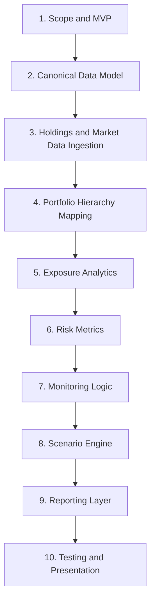

# RiskLens Guide and Progress Tracker

## Как использовать этот документ

Этот guide нужен как рабочая панель управления проектом. В нем можно:

- отмечать, что уже изучено;
- фиксировать, что уже реализовано;
- записывать текущий фокус;
- отмечать завершенные этапы и открытые вопросы.

Самый удобный способ работы:

1. Перед новой сессией открыть этот документ.
2. Посмотреть, какой этап сейчас в работе.
3. Отметить, что уже сделано.
4. Выбрать следующий маленький шаг.
5. После сессии обновить чекбоксы и заметки.

## 1. Project Snapshot

| Поле | Значение |
|---|---|
| Проект | RiskLens |
| Цель | Платформа аналитики портфельного риска и экспозиций |
| Основной стек | Python, SQL, PostgreSQL |
| Текущий статус | Planning / Early Build |
| Текущий фокус | Holdings ingestion + canonical data model |
| Следующий шаг |  |
| Последнее обновление |  |

## 2. Что изучать по порядку

| Порядок | Блок | Что нужно освоить | Статус | Комментарий |
|---|---|---|---|---|
| 1 | Python fundamentals | модули, функции, структуры данных, классы, dataclass, обработка ошибок | [ ] |  |
| 2 | Python project structure | пакеты, imports, CLI, конфигурация, тесты | [ ] |  |
| 3 | SQL basics | select, join, group by, case, cte, оконные функции | [ ] |  |
| 4 | PostgreSQL | schema design, constraints, indexes, views, loading data | [ ] |  |
| 5 | Pandas / NumPy | joins, groupby, time series, missing data, vectorized logic | [ ] |  |
| 6 | Portfolio structure | fund, legal entity, account, position, instrument | [ ] |  |
| 7 | Exposure analytics | gross/net exposure, issuer, sector, region, currency | [ ] |  |
| 8 | Risk metrics | volatility, drawdown, historical VaR | [ ] |  |
| 9 | Stress testing | scenario analysis, market shocks, stressed exposure | [ ] |  |
| 10 | Reporting thinking | dashboard marts, business outputs, monitoring views | [ ] |  |

## 3. Что нужно знать для проекта

### 3.1. Программирование и данные

| Область | Что нужно знать | Насколько уверенно | Что повторить |
|---|---|---|---|
| Python | структура проекта, dataclass, typing, обработка данных |  |  |
| SQL | joins, aggregations, windows, CTE, views |  |  |
| PostgreSQL | schema, keys, constraints, indexes, views |  |  |
| Pandas | merge, groupby, time series, cleaning |  |  |
| Data modeling | grain, entities, raw vs staging vs curated |  |  |
| Testing | unit tests, smoke tests, validation checks |  |  |
| Git | commits, branches, status, review of changes |  |  |

### 3.2. Финансы и риск

| Область | Что нужно понимать | Насколько уверенно | Что повторить |
|---|---|---|---|
| Holdings | position, quantity, market value, notional |  |  |
| Portfolio hierarchy | fund, legal entity, account, position |  |  |
| Exposures | gross, net, directional, grouped exposures |  |  |
| Concentration | issuer, sector, region, currency concentration |  |  |
| Returns | daily returns, cumulative returns |  |  |
| Volatility | historical volatility and interpretation |  |  |
| Drawdown | max drawdown and path dependency |  |  |
| VaR | historical Value at Risk and limitations |  |  |
| Stress testing | hypothetical and historical scenarios |  |  |
| Risk reporting | business meaning of dashboards and alerts |  |  |

## 4. Порядок выполнения проекта

| Шаг | Этап | Что должно появиться | Статус | Дата | Заметки |
|---|---|---|---|---|---|
| 1 | Scope and MVP | границы проекта и MVP definition | [ ] |  |  |
| 2 | Canonical data model | основные сущности и SQL schema | [ ] |  |  |
| 3 | Data ingestion | loaders, validation, staging outputs | [ ] |  |  |
| 4 | Hierarchy mapping | fund -> legal entity -> account -> position | [ ] |  |  |
| 5 | Exposure analytics | exposure views and grouped marts | [ ] |  |  |
| 6 | Risk metrics | volatility, max drawdown, historical VaR | [ ] |  |  |
| 7 | Monitoring | concentration checks and breach views | [ ] |  |  |
| 8 | Scenario engine | shock definitions and stressed outputs | [ ] |  |  |
| 9 | Reporting layer | dashboard-ready marts and summaries | [ ] |  |  |
| 10 | Presentation polish | docs, tests, demo storyline, cleanup | [ ] |  |  |

## 5. Implementation Backlog

### Phase 1. Foundation and Data Model

- [ ] Уточнить canonical entities
- [ ] Зафиксировать grain основных таблиц
- [ ] Подготовить schema DDL
- [ ] Уточнить naming conventions
- [ ] Согласовать, какие sample datasets нужны для MVP

### Phase 2. Ingestion and Hierarchy

- [ ] Сделать формат sample holdings CSV
- [ ] Сделать формат sample market data CSV
- [ ] Добавить базовую валидацию колонок
- [ ] Добавить нормализацию типов
- [ ] Реализовать hierarchy mapping

### Phase 3. Exposure Analytics

- [ ] Посчитать gross exposure
- [ ] Посчитать net exposure
- [ ] Сделать exposure by sector
- [ ] Сделать exposure by region
- [ ] Сделать exposure by currency
- [ ] Сделать top issuer concentration

### Phase 4. Risk Metrics and Monitoring

- [ ] Реализовать returns logic
- [ ] Реализовать volatility
- [ ] Реализовать max drawdown
- [ ] Реализовать historical VaR
- [ ] Реализовать issuer limit checks
- [ ] Реализовать concentration breach view

### Phase 5. Scenarios and Reporting

- [ ] Сделать equity selloff scenario
- [ ] Сделать FX shock scenario
- [ ] Сделать rates shock scenario
- [ ] Сделать daily risk summary mart
- [ ] Сделать scenario summary mart
- [ ] Подготовить dashboard-ready output layer

### Phase 6. Polish and Presentation

- [ ] Добавить больше unit tests
- [ ] Обновить архитектурную документацию
- [ ] Подготовить interview narrative
- [ ] Подготовить краткий demo flow
- [ ] Подчистить naming и структуру проекта

## 6. Weekly Progress Tracker

| Неделя / дата | Фокус недели | Что сделано | Что мешает | Следующий шаг |
|---|---|---|---|---|
|  |  |  |  |  |
|  |  |  |  |  |
|  |  |  |  |  |
|  |  |  |  |  |
|  |  |  |  |  |

## 7. Session Log

| Дата | Что делали | Какие файлы менялись | Результат | Что дальше |
|---|---|---|---|---|
|  |  |  |  |  |
|  |  |  |  |  |
|  |  |  |  |  |
|  |  |  |  |  |
|  |  |  |  |  |

## 8. Open Questions

| Вопрос | Почему важно | Решение / статус |
|---|---|---|
| Какой grain у holdings_snapshot? | Это влияет на join и агрегации |  |
| Какие scenario templates войдут в MVP? | Это влияет на scope scenario engine |  |
| Нужен ли отдельный security master layer? | Это влияет на data model |  |
| Какой BI output считать основным? | Это влияет на reporting layer |  |

## 9. Definition of Done

Используй этот блок как ориентир, когда будешь отмечать завершение этапов.

| Этап | Когда можно считать завершенным |
|---|---|
| Data model | сущности, grain и schema понятны и зафиксированы |
| Ingestion | sample data загружается стабильно и валидируется |
| Hierarchy | позиции агрегируются на нужных уровнях |
| Exposures | можно показать grouped exposures и concentrations |
| Risk metrics | volatility, drawdown и VaR работают воспроизводимо |
| Monitoring | breach logic отдает понятные сигналы |
| Scenarios | есть хотя бы 2-3 работающих stress scenarios |
| Reporting | есть dashboard-ready marts и summary outputs |
| Presentation | README, docs и storyline готовы для показа |

## 10. Следующее лучшее действие

Когда возвращаешься к проекту после паузы, начни отсюда:

- посмотреть `Project Snapshot`;
- отметить, что уже завершено;
- выбрать один незакрытый блок из `Implementation Backlog`;
- сделать один конкретный следующий шаг;
- после работы обновить чекбоксы и `Session Log`.
